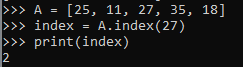

## **Penjelasan Array**

**Beberapa Fungsi yang Berkaitan dengan Array di Python**

   - **Index**: Fungsi ini digunakan untuk mengembalikan indeks kemunculan pertama yang nilainya disebutkan dalam argument. Ini digunakan jika ada kesalahan.

   - **Append**: Fungsi ini digunakan untuk menambahkan nilai di akhir daftar.

   - **Insert**: Fungsi ini digunakan untuk menyisipkan suatu nilai pada posisi tertentu. Argumen pertama adalah indeks dari elemen sebelumnya yang dimasukkan.

   - **Remove**: Fungsi ini digunakan untuk menghapus nilai pertama dari daftar.

   - **Pop**: Fungsi ini digunakan untuk menghapus item pada posisi tertentu dalam daftar, dan mengembalikannya. Jika tidak ada indeks yang ditentukan, a.pop () menghapus dan mengembalikan item terakhir dalam daftar.

   - **Count**: Fungsi ini digunakan untuk mengembalikan jumlah item dengan nilai yang ditentukan.

   - **Sort**: Fungsi ini digunakan untuk mengurutkan item dari daftar.

   - **Reverse**: Fungsi ini digunakan untuk mengembalikan urutan daftar.

   - **Extend**: Fungsi ini digunakan untuk memperpanjang daftar dengan menambahkan semua item dalam daftar yang diberikan.

   - **Len**: Fungsi ini digunakan untuk digunakan untuk mengembalikan nilai berupa jumlah item di daftar.

  ### Cara mendefinisikan array A = [25, 11, 27, 35, 18]
   
- **'A'** pada huruf di awal adalah nama Array
- dan angka **'[25, 11, 27, 35, 18]'** adalah jumlah elemnt di dalam sebuah array dari **'A'** di atas

### **Beberapa Fungsi yang Berkaitan dengan Array di Python**

---
- **Index**
   
    
- **Append**

    
- **Insert** 

    
- **Remove**

    
- **Pop**

    
- **Count**
    
    
- **Sort**
    
    
- **Reverse**
    
    
- **Extend**
    
    
- **Len**
    
    